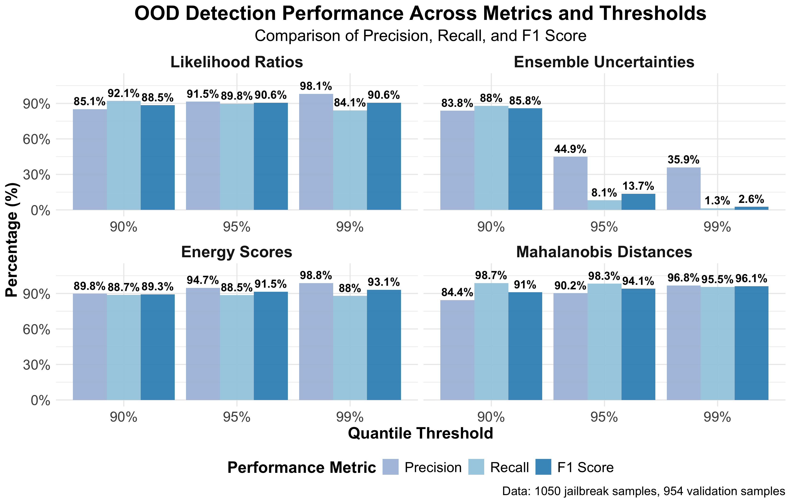

<h1 align="center">AdaptiveGuard Replication Package</h1>

<h4 align="center">This repository provides the replication package for our AdaptiveGuard experiments on continual LLM safety alignment. </h4>

<p align="center">
  
</p>

## 🛡️ Continual Guardrail — AdaptiveGuard

<p align="center">
  
</p>

---

## 📚 Table of Contents

1. [Environment Setup](#1-environment-setup)  
2. [Repository Structure](#2-repository-structure)
3. [Data Preparation](#3-data-preparation)
4. [Reproduce RQ1](#4-reproduce-rq1)  
5. [Reproduce RQ2](#5-reproduce-rq2)
6. [Reproduce RQ3](#6-reproduce-rq3)
7. [Citation](#7-citation)

---

## 1. Environment Setup

We recommend using **Python 3.12** for best compatibility and performance.

### Step 1: Install Python Requirements

To install all necessary dependencies, run:

```bash
pip install -r requirements.txt
```

### Step 2: Install PyTorch with CUDA

If you're using an NVIDIA GPU, we highly recommend installing PyTorch with CUDA support to accelerate training and inference.
Follow the official installation guide from PyTorch:
👉 https://pytorch.org/get-started/locally

---

## 2. Repository Structure

```
AdaptiveGuard/
├── scripts/           # Shell scripts for running experiments
├── src/              # Python source code
├── data/             # Dataset and data files
├── models/           # Pre-trained model checkpoints
├── imgs/             # Images for documentation
├── requirements.txt  # Python dependencies
└── README.md        # This file
```

---

## 3. Data Preparation

Before running experiments, prepare the attack data:

```bash
./scripts/combine_attack_files.sh
```

This script combines various attack datasets for evaluation across different jailbreak methods.

### Attack Types Used

We evaluate AdaptiveGuard against 10 different jailbreak attack methods:

- **AIM** (Always Intelligent and Machiavellian) [1]
- **DAN** (Do Anything Now) [2]  
- **Combination** (Prefix injection + Refusal Suppression) [3]
- **Self Cipher** [4]
- **Deep Inception** [5]
- **Caesar Cipher** [4]
- **Zulu** (Low-resource language attacks) [6]
- **Base64** (Encoding-based attacks) [3]
- **SmartGPT** [7]
- **Code Chameleon** [8]

---

## 4. Reproduce RQ1
### (RQ1) How effective is our AdaptiveGuard approach in identifying unknown jailbreak prompts?

<p align="center">
  
</p>

To reproduce RQ1 results, first train the AdaptiveGuard model, then run the out-of-distribution analysis:

### Train AdaptiveGuard Model
```bash
./scripts/train_aegis.sh
```

### Test AdaptiveGuard Model with OOD prompts
```bash
./scripts/test.sh
```

### Run OOD Analysis
```bash
./scripts/run_ood_analysis.sh
```

This experiment evaluates AdaptiveGuard's energy-based detection capability on the 10 attack types listed above.

Results will be saved in `results/ood_analysis_results/` directory.

---

## 5. Reproduce RQ2
### (RQ2) How quickly does our AdaptiveGuard approach adapt to unknown jailbreak attacks when continuously updated through detected OOD prompts??

<p align="center">
  
</p>

To reproduce RQ2 results, run the continual learning experiments:

<!-- ### Standard Continual Learning
```bash
./scripts/run_continual_learning.sh
``` -->

### AdaptiveGuard CL with LoRA 
```bash
./scripts/run_continual_learning_lora.sh
```

### LlamaGuard CL with LoRA
```bash
./scripts/run_llamaguard_continual_learning.sh
```

These experiments demonstrate:
- **Defense Success Rate (DSR)** improvements over time
- **Continual adaptation** to new attack patterns
- **Comparison** with baseline methods without CL

Results will be saved in:
<!-- - `continual_learning_results/`: Standard continual learning results -->
- `continual_learning_results_lora/`: AdaptiveGuard + CL results
- `llamaguard_continual_learning_results/`: LlamaGuard + CL results

---

## 6. Reproduce RQ3
### (RQ3) How much does our AdaptiveGuard approach forget original in-distribution prompts after continuous updates with detected OOD prompts?

<p align="center">
  
</p>

**Note**: RQ3 results are automatically generated when running the RQ2 experiments. No separate scripts need to be executed.

To analyze RQ3 results, examine the F1 scores from the RQ2 continual learning experiments:

### Analyze Results from RQ2 Experiments

The F1 scores for catastrophic forgetting analysis can be found in the results directories created during RQ2:

<!-- - `continual_learning_results/`: Contains F1 scores for standard continual learning -->
- `continual_learning_results_lora/`: Contains F1 scores for AdaptiveGuard + LoRA continual learning  
- `llamaguard_continual_learning_results/`: Contains F1 scores for LlamaGuard + LoRA results

### Key Metrics to Analyze

This analysis evaluates:
- **Catastrophic forgetting** on original in-distribution data
- **F1-score maintenance** across continual learning phases  
- **Balance** between new attack detection and original performance
- **Memory efficiency** of different adaptation strategies

The results show performance on both:
- Original benign prompts (measuring forgetting)
- New attack patterns (measuring adaptation)

### Analysis Focus

Look for:
1. **F1 score trends** over continual learning iterations
2. **Performance degradation** on original tasks
3. **Trade-offs** between new attack detection and original performance retention
4. **Comparison** across different methods (standard, LoRA, LlamaGuard)

<!-- ---

## 7. Key Components

### Core Source Files
- `src/main_energy_attack.py`: Main training and evaluation script
- `src/main_energy_attack_lora.py`: LoRA version of the main script
- `src/model.py`: Core model implementation with energy computation
- `src/llamaguard_continual_learning.py`: LlamaGuard continual learning
- `src/ood_detection_analysis.py`: OOD detection analysis tools

### Energy-Based Framework
1. **Energy Suppression**: Training with energy suppression loss on OOD data
2. **Continual Updates**: Incremental learning from detected jailbreak attempts  
3. **Memory Preservation**: Techniques to maintain performance on original data
4. **Threshold Adaptation**: Dynamic adjustment of detection thresholds

--- -->

---

## 7. Citation

```bibtex
under review
```

---

## 8. References

[1] Jailbreak Chat. "Jailbreak Chat Prompt." 2023. https://www.jailbreakchat.com/prompt/4f37a029-9dff-4862-b323-c96a5504de5d

[2] Shen, X., Chen, Z., Backes, M., Shen, Y., & Zhang, Y. (2023). "Do anything now": Characterizing and evaluating in-the-wild jailbreak prompts on large language models. *arXiv preprint arXiv:2308.03825*.

[3] Wei, A., Haghtalab, N., & Steinhardt, J. (2024). Jailbroken: How does llm safety training fail? *Advances in Neural Information Processing Systems*, 36.

[4] Yuan, Y., Jiao, W., Wang, W., Huang, J. T., He, P., Shi, S., & Tu, Z. (2023). Gpt-4 is too smart to be safe: Stealthy chat with llms via cipher. *arXiv preprint arXiv:2308.06463*.

[5] Li, X., Zhou, Z., Zhu, J., Yao, J., Liu, T., & Han, B. (2023). Deepinception: Hypnotize large language model to be jailbreaker. *arXiv preprint arXiv:2311.03191*.

[6] Yong, Z. X., Menghini, C., & Bach, S. H. (2023). Low-resource languages jailbreak gpt-4. *arXiv preprint arXiv:2310.02446*.

[7] Kang, D., Li, X., Stoica, I., Guestrin, C., Zaharia, M., & Hashimoto, T. (2024). Exploiting programmatic behavior of llms: Dual-use through standard security attacks. In *2024 IEEE Security and Privacy Workshops (SPW)* (pp. 132-143). IEEE.

[8] Lv, H., Wang, X., Zhang, Y., Huang, C., Dou, S., Ye, J., Gui, T., Zhang, Q., & Huang, X. (2024). Codechameleon: Personalized encryption framework for jailbreaking large language models. *arXiv preprint arXiv:2402.16717*.
